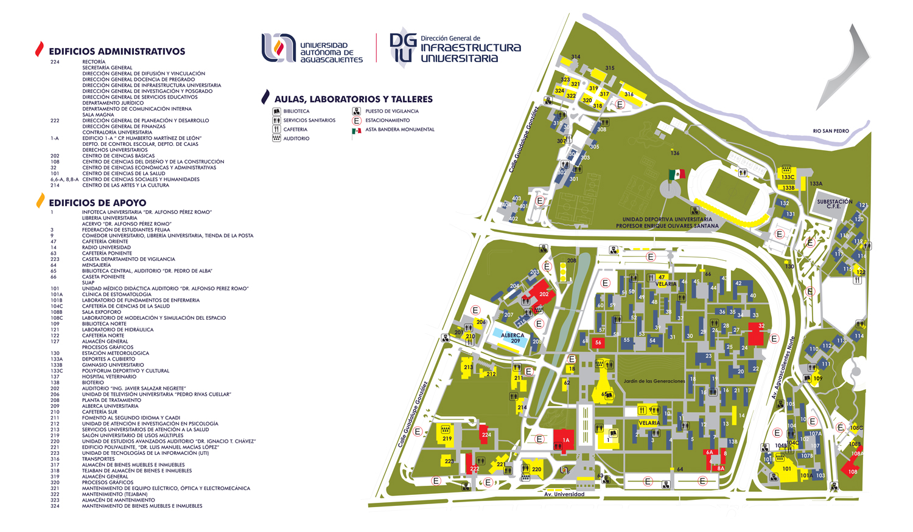
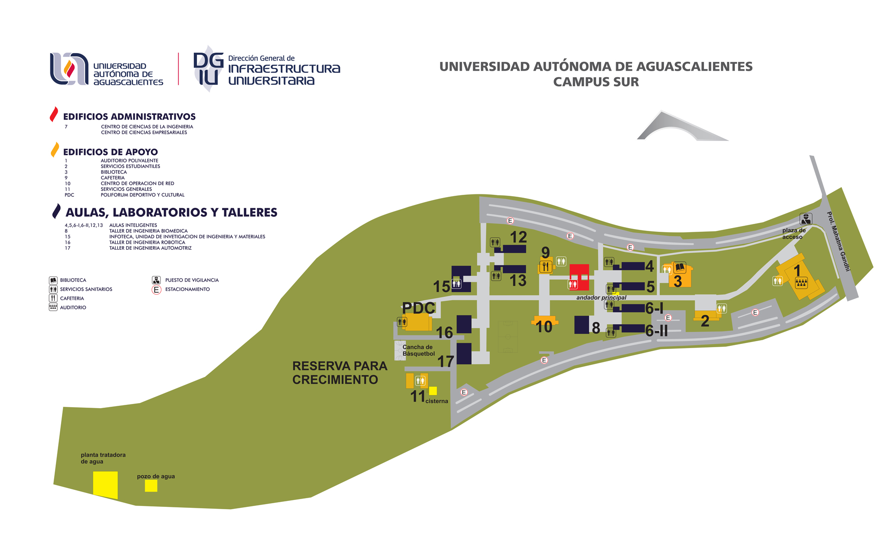

---

**[< Volver al Inicio](./)**

---

# Apoyo Universitario

Aquí no todo es código. La universidad es enorme y tiene un montón de programas y recursos de apoyo que a veces no conocemos o que son difíciles de encontrar.

Esta sección es para agrupar esos enlaces importantes que nos ayudan a navegar la vida universitaria, desde encontrar un salón hasta planear un intercambio.

---

## Mapas del Campus

Para no perdernos el primer día de clases (o en quinto semestre).

**Instrucción:** Para que los mapas funcionen, primero crea una carpeta `assets` en tu repositorio, y dentro de ella otra carpeta llamada `mapas`. Sube tus imágenes (`mapa-norte.jpg`, `mapa-sur.jpg`) a esa carpeta.

### Campus Norte
*(Haz clic en la imagen para ver en alta resolución)*

### Campus Sur
*(Haz clic en la imagen para ver en alta resolución)*

---

## Enlaces Institucionales

Enlaces directos a los programas de apoyo académico y profesional de la UAA.

* [Pagina oficial](https://www.uaa.mx/portal/)

### Movilidad Estudiantil
* [Becas Externas para Movilidad](https://www.uaa.mx/portal/becas-externas-para-movilidad/)
* [Ayuda y Guía de Movilidad Pregrado](https://www.uaa.mx/portal/movilidad-e-intercambios/movilidad-pregrado/)

### Desarrollo Profesional
* [Bolsa de Trabajo de la UAA](https://www.uaa.mx/portal/alumnos/bolsa-de-trabajo/)
* [Programa para Emprendedores](https://www.uaa.mx/portal/alumnos/programa-para-emprendedores/)

### Trámites Académicos
* [Prácticas Profesionales](https://www.uaa.mx/portal/alumnos/practicas-profesionales/)
* [Servicio Social](https://www.uaa.mx/portal/alumnos/servicio-social/)

### Apoyo Académico
* [Programa de Tutorías (Buscar tutor / Ser tutor)](https://esiima.uaa.mx/exsiima/xwgtp_menu.jsp)

---

**[< Volver al Inicio](./)**